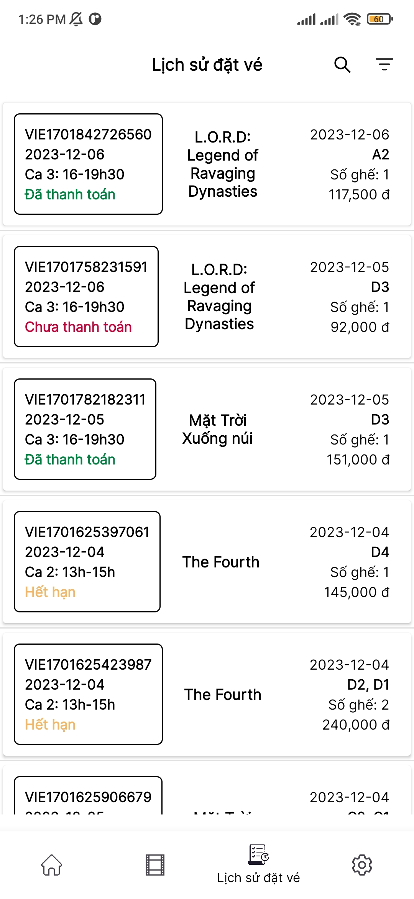

# FALL23/PRO2052/PRO2052-TRI-FORCE
# FCinema Booking App
FCinema Booking App là một ứng dụng đặt vé xem phim. Ứng dụng được xây dựng trên nền tảng Android, sử dụng ngôn ngữ Java cho phía client và Node.js, Handlebars template, Bootstrap 5 cho phía [server](https://github.com/FA2023-PRO2052-TRI-FORCE/CINEMA_SEVER). Database sử dụng là MySQL.

## Thành viên

| STT | Họ và tên | Task|
|---|---| --- |
| 1 | Nguyễn Văn Đoàn  |Phim đang chiếu - sắp chiếu, đặt vé, thanh toán.
| 2 | Hồ Văn Hà  | (1) Giao diện cho các chức năng: đăng ký, đăng nhập, tài khoản.
| 3 | Hà Ngọc Duy |(2) Giao diện cho chức năng: lịch sử đặt vé.
| 4 | Lô Tiến Đạt  | Chỉnh sửa giao diện, viết mã cho các chức năng còn lại (1) (2).

## Chức năng chính
1. Đăng ký, xác thực email (gửi OTP về email)
2. Đăng nhập - đăng xuất, lưu mật khẩu
3. Quên mật khẩu gửi OTP về email
4. Thay đổi thông tin (thông tin người dùng, mật khẩu)
5. Xem danh sách, xem chi tiết, tìm kiếm theo tên, lọc theo ngày chiếu (Phim đang chiếu)
6. Xem danh sách, xem chi tiết, tìm kiếm theo tên, lọc theo thể loại (Phim sắp chiếu)
7. Đặt vé (chọn ghế, chọn đồ ăn)
8. Thanh toán bằng Zalo Pay
9. Xem danh sách, xem chi tiết, tìm kiếm, lọc theo trạng thái vé đã đặt.

## Một số giao diện

| |  |
|---|---|
|<h4 align="center">Giao diện màn hình chào</h4> |<h4 align="center">Giao diện màn hình đăng nhập</h4> |
|<h4 align="center">Màn hình chính</h4> |<h4 align="center">Chi tiết phim đang chiếu </h4> |
|<h4 align="center">Màn hình Chọn ghế </h4> |<h4 align="center">Thanh toán</h4> |
|  <h4 align="center"> Danh sách vé đã đặt</h4> | <h4 align="center">Cài đặt</h4> |
